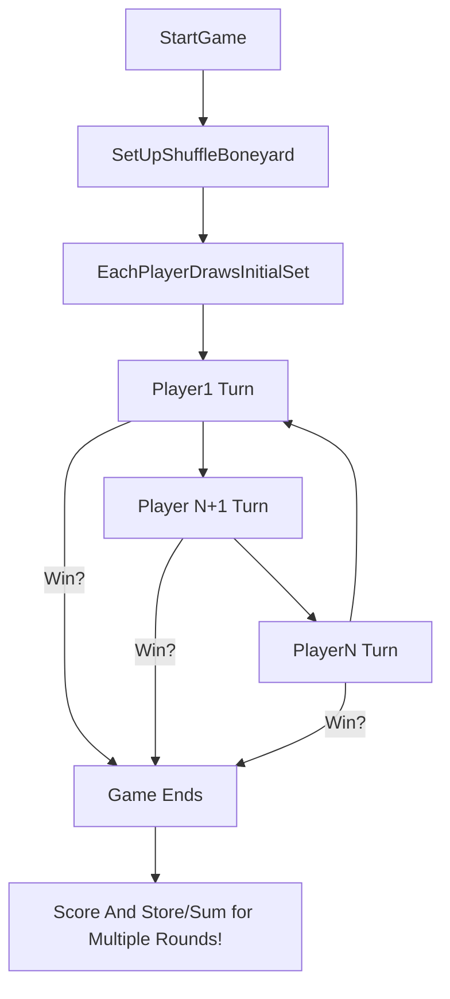
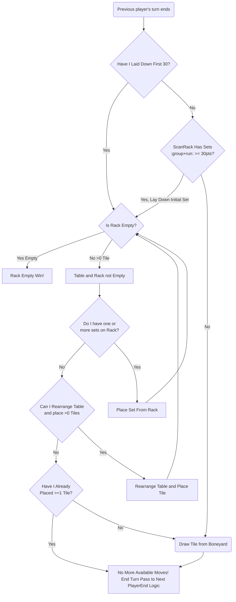

# Rustikub
A simulation of the tabletop game Rummikub, built entirely in Rust. 
Someday, may or may not include a UI as well. 

# Design
High level diagrams of the events in the game and the basic logic for how they interact. See /resources for the official Rummikub rules.

## Basic Game Loop


## Individual Player Turn


## Domain Model Types
```typescript
enum Number {One,Two,Three,Four,Five,Six,Seven,Eight,Nine,Ten,Eleven,Twelve,Thirteen}
enum Color {Red,Blue,Orange,Black}

interface RegularTile {
    color: Color,
    number: Number,
}
interface Joker {};
type Tile = RegularTile | Joker;

type Group = {
    // Only one from each color of the same number
    members: Map<Color, boolean>
}
type Run = {
    // Must be a sequantially ordered set of tiles with same color
    color: Color,
    members: Number[],
}
type Set = Group | Run;

type Boneyard = {
    drawPile: Tile[],
  }
type PlayerRack = {
    rows: Tile[],
}
```


# Repository Layout
*At least as of writing*

```
.
├── Cargo.lock
├── Cargo.toml
├── LICENSE.md
├── README.md
├── resources
│   └── Rummikub_Official_Rules.pdf
├── src
│   ├── domain
│   │   ├── boneyard.rs
│   │   ├── sets.rs
│   │   ├── table.rs
│   │   └── tiles.rs
│   ├── domain.rs
│   └── main.rs
└── tests
    └── integration_tests_only.rs
```